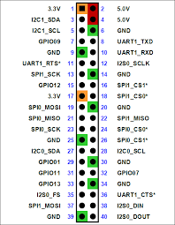

#jetson_guide

## Downgrade the Snap version to run firefox browser

```bashe
snape download snapd --revision=24724
sudo snap ack snapd_24724.snap
sudo sudo snap refresh --hold snapd
```

## How to configure GPIO pins
1. Run the following command in a terminal:

```bash
sudo /opt/nvidia/jetson-io/jetson-io.py
```



